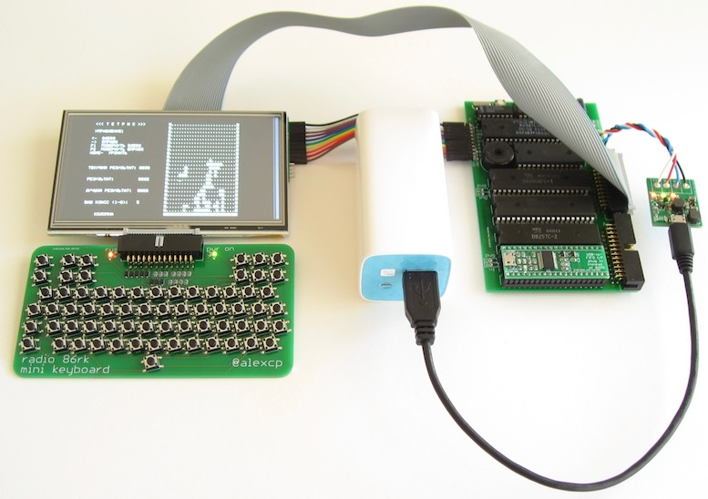

# Connecting Radio-86RK to TFT display panel

Connecting TFT display with 24bit RGB parallel interface to Intel i8275 CRTC

## Introduction

For many home computers from 1980s, TV was the only display available, and [Radio-86RK](https://github.com/mac2rk/Radio-86RK-SRAM) is no exception. Back then, it made total sense, but today, TVs with composite video input gradualy disappear, and being tethered to one when playing with a 8-bit retro computer is, well, too much retro.

Turns out, small TFT display panels are now available, affordable, and can be connected to Radio-86RK relatively easily.

This project is a hardware interface between Intel i8275 CRT controller and a 480x272 pixel TFT panel [ER-TFT050-2](https://www.buydisplay.com/download/manual/ER-TFT050-2_Datasheet.pdf) with the ILI6482 controller onboard, exposing 24-bit RGB parallel interface. The inteface supports 4-bit (IRGB) color, although color is not implemented in [Radio-86RK](https://github.com/mac2rk/Radio-86RK-SRAM).

## Schematic

[Schematic](Eagle/rk86_tft-schematic.pdf)

In the schematic, IC3 converts logic levels from 5V of [Radio-86RK](https://github.com/mac2rk/Radio-86RK-SRAM) to 3.3V required by the TFT panel; IC6 feeds the TFT panel's backlight (a string of white LEDs) with constant current; IC7 provides I2C interface for the resistive touchscreen; IC8 regulates +5V poswer supply down to +3.3V. Q1 provides protection against wrong power supply polarity, Q2 and Q3 convert I2C voltage levels.

IC4 and IC5.1 form the brown color `#AA5500`instead of unsightly "dark yellow" `#AAAA00` for IRGB=0b0110, forming the standard CGA palette:

4-bit IRGB code | 24-bit color | Color
--------------- | ------------ | -----
0b0000          | `#000000`    | Black
0b0001          | `#0000AA`    | Blue
0b0010          | `#00AA00`    | Green
0b0011          | `#00AAAA`    | Cyan
0b0100          | `#AA0000`    | Red
0b0101          | `#AA00AA`    | Magenta
0b0110          | `#AA5500`    | Brown
0b0111          | `#AAAAAA`    | Light gray
0b1000          | `#555555`    | Dark gray
0b1001          | `#5555FF`    | Bright blue
0b1010          | `#55FF55`    | Bright green
0b1011          | `#55FFFF`    | Bright cyan
0b1100          | `#FF5555`    | Bright Red
0b1101          | `#FF55FF`    | Bright magenta
0b1110          | `#FFFF55`    | Yellow
0b1111          | `#FFFFFF`    | White

IC2's function is specific to [Radio-86RK](https://github.com/mac2rk/Radio-86RK-SRAM). In Radio-86RK, the i8275 CRTC forms a raster with 300 horizontal lines, although top 30 and bottom 20 are not used for display. The TFT panel, however, is only 272 pixels tall, so 300-20-272=8 lines at the bottom  of the display area do not fit. Thankfully, the TFT panel ignores HRTC pulses and is completely controlled by VRTC and DEN (Data ENable) signals. IC2 delays the DEN (Data ENable) signal for the TFT panel by 16 lines, fitting the full display area into the panel without reprogramming the CRTC and ensuring compatibility with existing software.

## PCB layout

[PCB layout](Eagle/rk86_tft-board.pdf)

## Bill of Materials

Name              | Part      | Value       | Package | Quantity
----------------- | --------- | ----------- | ------- | --------
ER-TFT050-2       | LCD panel | ER-TFT050-2 |         | 1
ER-TFT050-2       | 30-way 0.5mm FPC connector, top contact |  | Molex 54014-4031 | 1
IC1               | Logic IC  | 74HC04PW    | TSSOP14 | 1
IC2               | Logic IC  | 74HC161PW   | TSSOP16 | 1
IC3               | Logic IC  | 74LVC8T245DBQR | TSSOP24 | 1
IC4               | Logic IC  | QS3VH253PAG | TSSOP16 | 1
IC5               | Logic IC  | 74HC08PW    | TSSOP14 | 1
IC6               | Backlight Driver IC | AP3019AKTR | SOT23-6 | 1
IC7               | Touchscreen Controller IC | TSC2007PW | TSSOP16 | 1
IC8               | Voltage Reg IC | MCP1700T-3302E/TT | SOT23-3 | 1
Q1                | Pch MOSFET | FDC658P    | SOT23-6 | 1
Q2,Q3             | Nch MOSFET | BSS138     | SOT23-3 | 2
R1,R2,R4..R7      | Resistor  | 10kOhm | 0805    | 6
R3                | Resistor  | 5ohm   | 0805    | 1
R8..R13           | Resistor  | 220ohm | 0805    | 6
C1..C6, C11, C13  | Capacitor | 0.1uF  | 0805    | 8
C8, C10, C12, C14 | Capacitor | 10uF   | 0805    | 4
C9                | Capacitor | 0.22uF | 0805    | 1
L1                | Inductor | 22uH    | Coilcraft XTL7030 | 1
CLK,DEN,HRTC,I2C,PWR,VRTC | LED |      | 0805    | 6
JP1         | 0.1" Pin Header |        | 1x10    | 1
I2X1        | 0.1" Pin Header |        | 1x4     | 1
